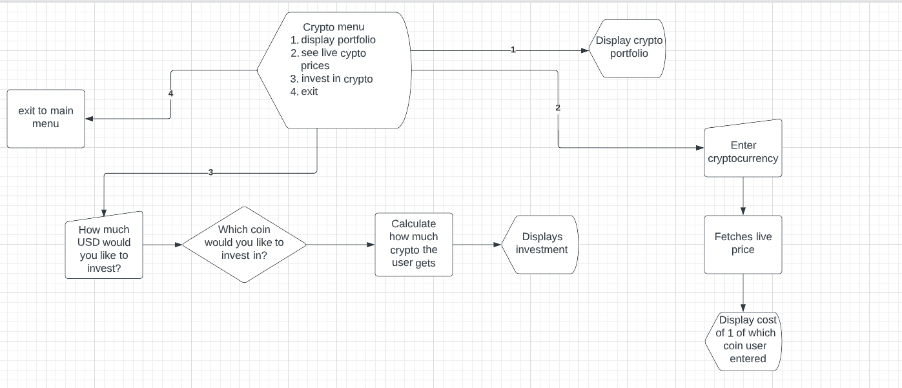

# Bank Wicksy

I have created a banking system, which allows a user to withdraw or deposit moeny, while also being able to create a cryptocurrency portfolio. The user will be able to invest in whatever cryptocurrency they desire, while retriving the real time values of each cryptocurrency via an api.

[Click here to go to the live site](https://advanced-banking-system.herokuapp.com/)

## Features

### Landing Page

- I have created a large and bold message using the figlet module in python for a unique style of font. 

### Main Menu

- This is the main menu, which has a variety of options the user can choose from, for example: withdraw, deposit and check their balance.

### Crypto Menu

- This menu shows the actions that the user can take with their cryptocurrency, for example: viewing life cryptocurrency prices, investing USD into cryptocurreny of their choice and viewing there investments in the investment portfolio.

## Flow Charts

## Technologies used

### Languages, Frameworks, Libaries and Programs Used

- add links to all 

1. [Python](https://www.python.org/)

2. [Git](https://git-scm.com/)
- I used Git for version control by using the Gitpod terminal to commit to Git and Push to GitHub.

3. [GitHub](https://github.com/)
- GitHub is used to store coding projects.

4. [Os Libary](https://docs.python.org/3/library/os.html)
- Used to clear the terminal

5. [Heroku](https://www.heroku.com/)
- Software I used to deploy this project. 

6. [LucidChart](https://www.lucidchart.com/pages/)
- Software that I used to create flowcharts.

7. [AMIResponsive](https://ui.dev/amiresponsive)
- I used this to generate the image at the top of the readme displaying my project in different sized devices.

8. [CoinMarketCap](https://coinmarketcap.com/)
- Used the CoinMarketCap API to retrieve live cryptocurrency coin data

9. [PEP8online](http://pep8online.com/)
- Used to validate python code

10. [Colorama](https://pypi.org/project/colorama/)
- This Libary is used to color text when the code is run in the terminal.

11. [PromptToolkit](https://python-prompt-toolkit.readthedocs.io/en/master/)
- I used this libary to create a autotype automation function, which gives the user a drop-down menu of what coins they can select based on what they have started typing. 

12. [Requests](https://pypi.org/project/requests/)
- This libary allows me to sent HTTP requests without having to manually add query strings to the URLs.

## Testing

Click [here](TESTING.md) to access the testing page

### Data Models

## Class

- I have made User a class and Bank a class, this allows me to have the option to create multiple users with each one having their own sperate bank account. Also I can pass the users attributes into their bank account, therefore allowing me to input their names alongside their bank information for every user. 

## Deployment
​
Code Institute has provided a [template](https://github.com/Code-Institute-Org/python-essentials-template) to display the terminal view of this backend application in a modern web browser. This is to improve the accessibility of the project to others.
​
The live deployed application can be found at [advanced-banking-system](https://advanced-banking-system.herokuapp.com/).
​
### Local Deployment
​
*Gitpod* IDE was used to write the code for this project.
​
To make a local copy of this repository, you can clone the project by typing the following into your IDE terminal:
- `git clone https://github.com/advanced-banking-system-proj-3.git`
​
Alternatively, if using Gitpod, you can click below to create your own workspace using this repository.
​

​
### Heroku Deployment
​
This project uses [Heroku](https://www.heroku.com), a platform as a service (PaaS) that enables developers to build, run, and operate applications entirely in the cloud.
​
Deployment steps are as follows, after account setup:
​
- Select *New* in the top-right corner of your Heroku Dashboard, and select *Create new app* from the dropdown menu.
- Your app name must be unique, and then choose a region closest to you (EU or USA), and finally, select *Create App*.
- From the new app *Settings*, click *Reveal Config Vars*, and set the value of KEY to `PORT`, and the value to `8000` then select *add*.
- Further down, to support dependencies, select *Add Buildpack*.
- The order of the buildpacks is important, select `Python` first, then `Node.js` second. (if they are not in this order, you can drag them to rearrange them)
​
Heroku needs two additional files in order to deploy properly.
- requirements.txt
- Procfile
​
You can install this project's requirements (where applicable) using: `pip3 install -r requirements.txt`. If you have your own packages that have been installed, then the requirements file needs updated using: `pip3 freeze --local > requirements.txt`
​
The Procfile can be created with the following command: `echo web: node index.js > Procfile`
​
For Heroku deployment, follow these steps to connect your GitHub repository to the newly created app:
​
- In the Terminal/CLI, connect to Heroku using this command: `heroku login -i`
- Set the remote for Heroku: `heroku git:remote -a <app_name>` (replace app_name with your app, without the angle-brackets)
- After performing the standard Git `add`, `commit`, and `push` to GitHub, you can now type: `git push heroku main`
​
The frontend terminal should now be connected and deployed to Heroku.

- add steps how to get coin api key

- how to set up env.py
- see [env_sample](env_sample.py) for an example.

- 
## Credits

- I have used this tutorial to guide me through the project, while expanding on it with my own ideas. [You Tube video](https://www.youtube.com/watch?v=BRssQPHZMrc)

- I used this video to help me fetch data using an api, as this was something I was not familiar with. [Api video](https://www.youtube.com/watch?v=ECJjjZ_iijc&t=1s)

- Mentor (Tim Nelson)

- Tutor support