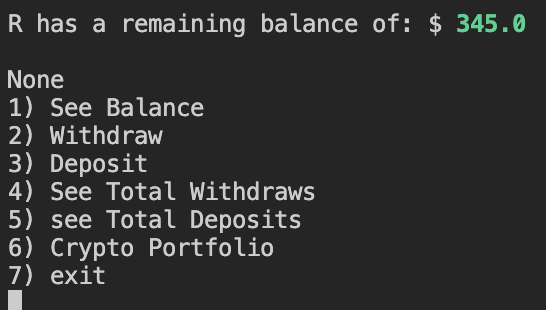
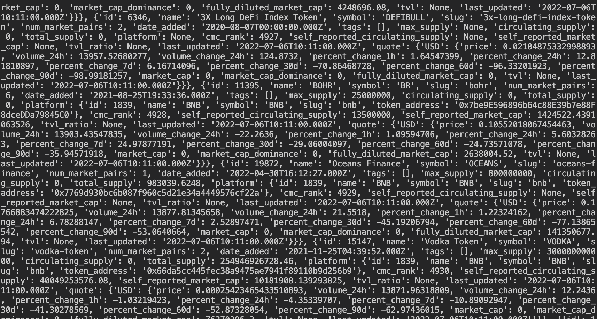
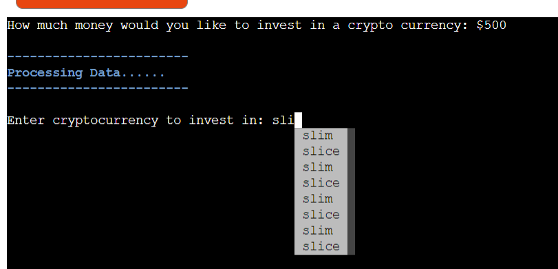
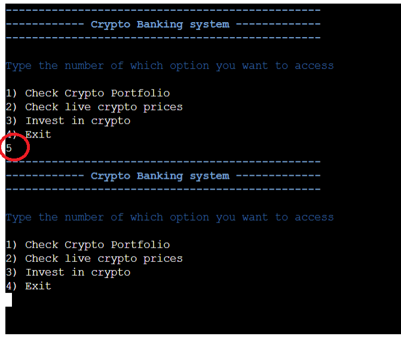
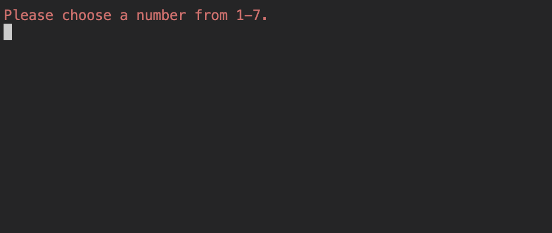

# Testing 

## Code Validation

- PEP8 Online Check

- Results for run.py


- Results for coinmarketcap.py


- [W3Cvalidator](https://validator.w3.org/) HTML validator


- User input validation


## Bugs/Problem solving

- One challenge I faced was passing two variables from one function into another in the same class.
To solve this is I returned the two variables in the below function I wanted to pass into calculate_crypto().
I combined both variables in a string with '/' in between, which will make it easy for me to sperate the variables once they have been passed into the calculate_crypto() function.
This allows me to have 1 parameter instead of two in calculate_crypto(), which reduces the amount of overall code.

- part of amount_to_invest() below:
```python
if crypto_type in crypto_List:
    return f'{amount}/{crypto_type}'
    break
```
- when calling the above function I saved the return statement as 'a', which is then passed into the calculate_crypto() function as shown below:

```python
 a = (user_one_portfolio.amount_to_invest(user_one_balance))
values = user_one_portfolio.calculate_crypto(a)
```

- From here I used the split method to separate the variables into their original state. See this in the below image.

```python
def calculate_crypto(self, crypto_info):
        """
        Calculates the price of which cryptocurrency the user wants
        and returns the amount of crypto he has invested in
        """
        price = 0
        amount = crypto_info.split('/')[0]
        coin = crypto_info.split('/')[1]
        for x in coins:
            if x['symbol'].lower() == coin.lower():
                price = float(x['quote']['USD']['price'])
        amount_of_crypto = float(amount)/price
        print(
            f'crypto: {Fore.GREEN}{Style.BRIGHT}{coin}{Fore.RESET} '
            f'amount: {Fore.GREEN}{Style.BRIGHT}{amount_of_crypto}\n')
        time.sleep(2)
        clear_terminal()
        return f'crypto: {coin} amount: {Fore.GREEN}{amount_of_crypto}\n'
```

- I was getting the word 'None' printed out which was unnecessary as shown in the image below. 



- To prevent the word 'none' from being printed out, I removed the print statement which was wrapped around the part where I called the function `print(user_one_portfolio.display_crypto_portfolio())`. Within the balance.info() function, there was a print statement already being returned so the wrapped print statement did not have anything to print so it printed none. Below is fixed code.

```python
options_choice = get_int(
            '1) Check Crypto Portfolio\n2) Check live crypto prices\n3) '
            'Invest in crypto\n4) Exit\n')
        if options_choice == 1:
            clear_terminal()
            user_one_portfolio.display_crypto_portfolio()
```

- I needed to extract the cryptocurrency abbreviated names from the data the API fetched. As seen below



- I used the below function to loop through the data, so that when it lands on 'symbol' the cryptocurrency 'BTC' for example will be added to a list. This process is continued untill the all the data has been searched.

```python
def get_crypto_list():
    """"
    Accumulates all the cryptocurrencies that the api can get,
    example - Bitcoin, and stores them all in a list
    """

    for d in data['data']:
        crypto_name_from_api = d['symbol']
        crypto_List.append(crypto_name_from_api)
```

- The list for then look the image below, which will become my cryptocurrency bank where the user can choose to invest in any one of these cryptocurrencies within the list 


- Each time the user would search for a cryptocurrency, the crypto_list would duplicate eachtime resulting in multiple of the same cryptocurrencies shown in the word completer below.



- To fix this I commeneted out calling `get_crypto_list()` within the cryptocurrency functions shown in the image below. And placed near the bottom of my [run.py](run.py) page so the function is only run once.

```python
elif options_choice == 2:
            clear_terminal()
            user_one_portfolio.display_values()

        elif options_choice == 3:
            clear_terminal()
            a = (user_one_portfolio.amount_to_invest(user_one_balance))
            values = user_one_portfolio.calculate_crypto(a)
            investment_list.append(values)

```

- When the user is faced with the crypto menu, if the user entered '5'. There would be no error message which is shown below



- To fix this, I cleared the terminal momentarily so it would be obvious to the user what went wrong because the only text displayed is the error message as shown below.

