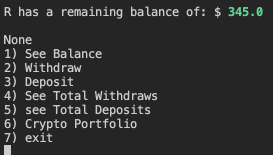
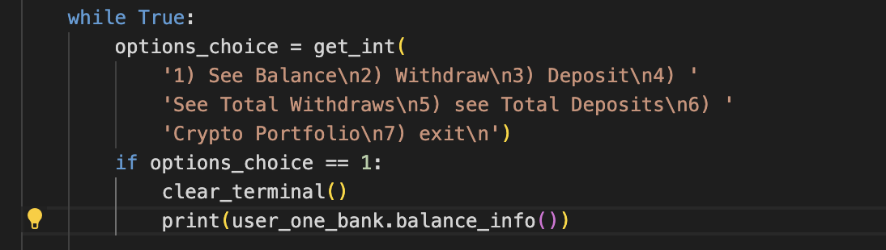

# Testing 

## Code Validation

- PEP8 Online Check

- Results for run.py

- Results for coinmarketcap.py

- [W3Cvalidator](https://validator.w3.org/) HTML validator

- User input validation

## Bugs

- I was getting the word 'None' printed out which was unnecessary as shown in the image below.

- The second image shows the problem within the code 

- To prevent the word 'none' from being printed out, I removed the print statement which was wrapped around the part where I called the function. Within the balance.info() function, there was a print statement already being returned so the wrapped print statement did not have anything to print so it printed none.

