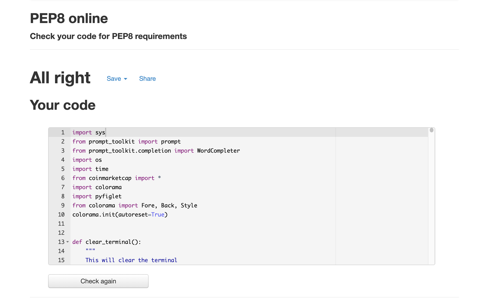
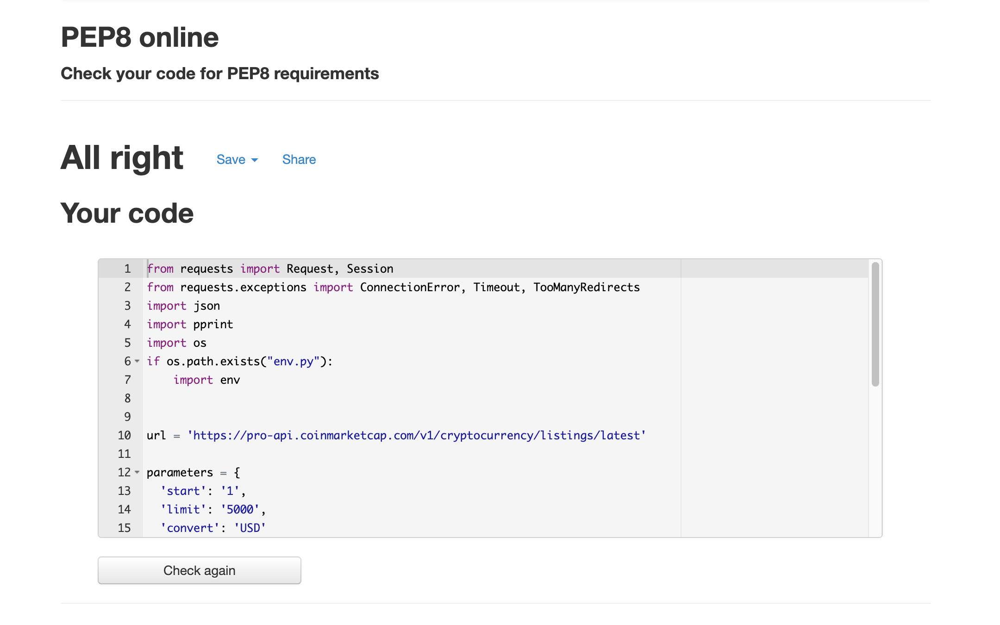
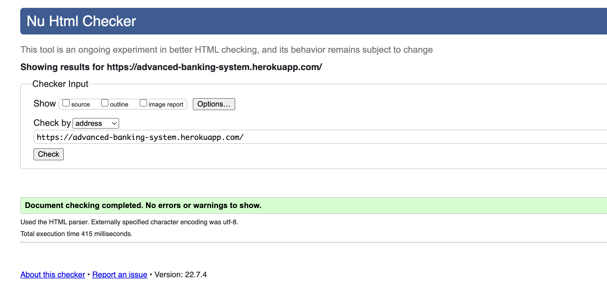
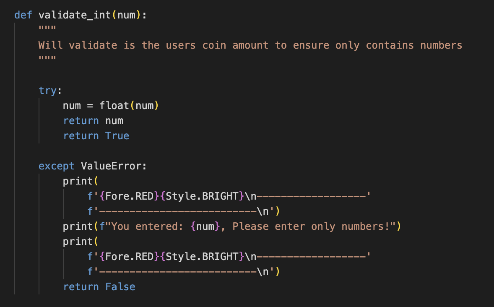
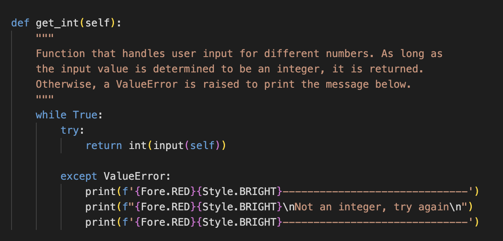
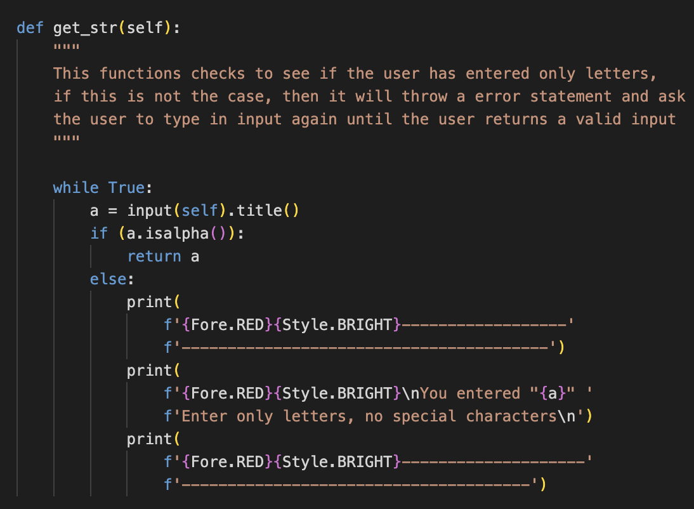

# Testing 

## Code Validation

- PEP8 Online Check

- Results for run.py

- Results for coinmarketcap.py

- [W3Cvalidator](https://validator.w3.org/) HTML validator

- User input validation

## Bugs

